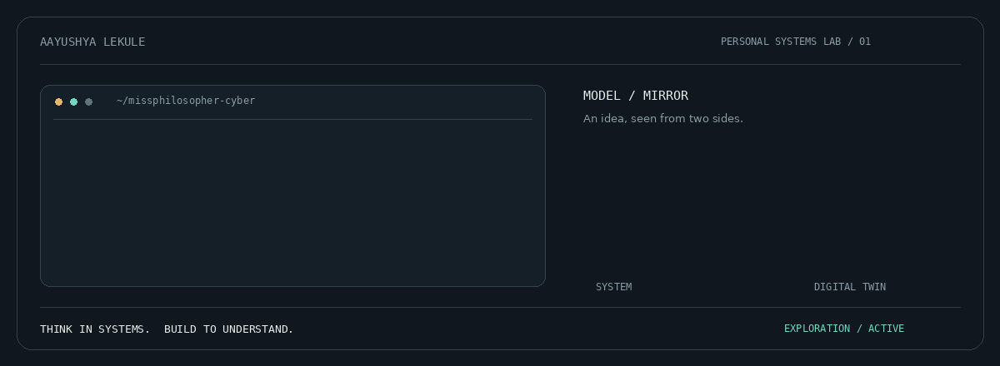

  

<picture>
  <source media="(prefers-color-scheme: dark)" srcset="./title-dark.svg" />
  <source media="(prefers-color-scheme: light)" srcset="./title-light.svg" />
  
</picture>

<picture>
  <source media="(prefers-color-scheme: dark)" srcset="./divider-dark.svg" />
  <source media="(prefers-color-scheme: light)" srcset="./divider-light.svg" />
  
</picture>

<picture>
  <source media="(prefers-color-scheme: dark)" srcset="./about-dark.svg" />
  <source media="(prefers-color-scheme: light)" srcset="./about-light.svg" />
  
</picture>

I'm **Aayushya Lekule**, a Computer Science student at
**MIT-WPU**, specializing in **Cybersecurity & Forensics**.

I think in systems and learn by building. This is where I turn
concepts into working programs, test ideas, and document the
decisions behind them.

<picture>
  <source media="(prefers-color-scheme: dark)" srcset="./workbench-dark.svg" />
  <source media="(prefers-color-scheme: light)" srcset="./workbench-light.svg" />
  
</picture>

### Python from scratch
A growing collection of programs and mini projects—from
fundamentals toward more advanced implementations.

### Applied machine learning
Exploring supervised learning, model evaluation, and data
visualization through practical experiments.

### Digital-twin research
Exploring digital-twin modelling and security.
Research is ongoing; the scope is still evolving.

<picture>
  <source media="(prefers-color-scheme: dark)" srcset="./tools-dark.svg" />
  <source media="(prefers-color-scheme: light)" srcset="./tools-light.svg" />
  
</picture>

**Languages:** Python · SQL

**Data & visualization:** Pandas · NumPy · Matplotlib · Seaborn

<picture>
  <source media="(prefers-color-scheme: dark)" srcset="./work-dark.svg" />
  <source media="(prefers-color-scheme: light)" srcset="./work-light.svg" />
  
</picture>

- Working programs with clear instructions and example outputs.
- Experiments with visual results and explanations.
- Project decisions, limitations, and improvements.
- A record of progress through increasingly challenging builds.

<picture>
  <source media="(prefers-color-scheme: dark)" srcset="./divider-dark.svg" />
  <source media="(prefers-color-scheme: light)" srcset="./divider-light.svg" />
  
</picture>

  Think in systems. Build to understand.

